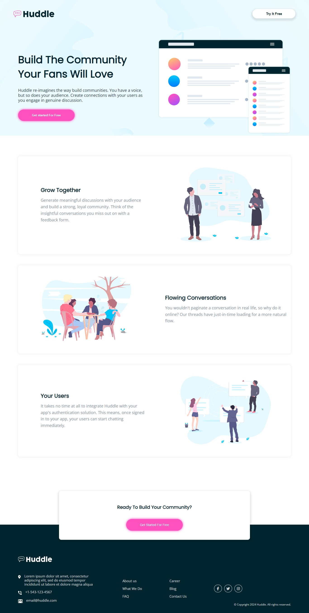

# Frontend Mentor - 3-column preview card component solution

This is a solution to the Huddle Landing Page With Alternating Feature Blocks challenge on Frontend Mentor. Frontend Mentor challenges help you improve your coding skills by building realistic projects.

## Table of contents

- [Overview](#overview)
  - [The design preview](#the-design-preview)
  - [Solution](#Solution)
- [My process](#my-process)
  - [Built with](#built-with)
- [Author](#author)

## Overview

### The design preview

### Solution

- Solution URL: [huddle-landing-page-with-alternating-feature-blocks](https://github.com/SamerAyash/huddle-landing-page-with-alternating-feature-blocks)
- Live Site URL: [github.io/huddle-landing-page-with-alternating-feature-blocks](https://SamerAyash.github.io/huddle-landing-page-with-alternating-feature-blocks)

### Built with

- Semantic HTML5 markup
- CSS custom properties
- Media query
- CSS Web Fonts
- Fontawesome library for icons;

## Author
:: Samer Ayash
- GitHub - [SamerAyash](https://github.com/SamerAyash)
- Frontend Mentor - [@SamerAyash](https://www.frontendmentor.io/profile/SamerAyash)
